# About the Project

## 💡 What Inspired Me

As a developer working with distributed teams, I faced a frustrating problem: **hundreds of unread messages** in group chats after weekends or busy periods. Important decisions, shared links, and valuable discussions were buried in endless scrolls.

I constantly found myself asking:
- *"Can someone summarize what I missed?"*
- *"Where was that article someone shared yesterday?"*
- *"We need to fact-check this claim without leaving the chat"*

**My breaking point:** I spent 2 hours searching through 500+ messages for one crucial project decision.

I realized teams everywhere need an AI assistant that could instantly summarize conversations, pull real-time information from the web, and provide expert analysis - all without leaving the chat.

## 🚀 How I Built It

### AWS Serverless Architecture
I chose a serverless-first approach because chat traffic is unpredictable - sometimes 1 user, sometimes 50 simultaneously. Each AWS service provides specific benefits:

**Lambda Trigger Flow:** Telegram webhook → API Gateway → Lambda function

```mermaid
graph LR
    A[📱 Telegram] --> B[🚪 API Gateway]
    B --> C[⚡ Lambda]
    C --> D[🧠 OpenAI]
    C --> E[🗄️ S3 Storage]
```



### AWS Service Benefits

**⚡ AWS Lambda**: Perfect for AI workloads - auto-scales instantly, pay only for compute time, zero server management

**🚪 API Gateway**: Reliable webhook endpoint with built-in security, rate limiting, and request validation

**🗄️ Amazon S3**: Infinite storage for conversation history, sub-second retrieval, automatic backup and versioning

**📊 CloudWatch**: Real-time monitoring and debugging - essential for production AI applications

### Intelligent Agent System
Instead of a simple chatbot, I built a multi-tool AI agent:
```javascript
const agentTools = [
  'search',      // Real-time web search
  'messages',    // S3-based conversation retrieval  
  'images',      // Computer vision analysis
  'analyze',     // Content summarization
];
```

## 📚 What I Learned

- **Lambda scales beautifully for AI**: Auto-scaling handles unpredictable processing demands without configuration
- **S3 beats traditional databases**: For conversation storage, S3's simplicity and cost-effectiveness won over complex database setups
- **API Gateway is rock-solid**: Never had a webhook failure in production - the reliability is incredible
- **CloudWatch saves debugging time**: Instant logs and metrics made troubleshooting production issues trivial

## 🎢 Challenges I Faced

### Package Size Limits
**Problem:** AI dependencies exceeded 50MB Lambda limit  
**Solution:** Automated S3-based deployment for large packages

### Response Time vs Expectations  
**Problem:** AI analysis takes 30+ seconds, users expect instant responses  
**Solution:** Progressive status updates during processing

### Conversation Memory at Scale
**Problem:** Efficiently storing/retrieving chat history across multiple groups  
**Solution:** Smart S3 folder structure with optimized retrieval algorithms

## 🏆 The Result

I built an intelligent team assistant that transforms group collaboration. The most rewarding moment: a user said *"This bot saved me 2 hours of reading messages. I got caught up in 30 seconds!"*

**Key Impact:**
- ✅ 80% reduction in manual information management
- ✅ Real-time fact-checking without leaving chat
- ✅ Instant conversation summaries
- ✅ Searchable team knowledge base

*Everything Bot demonstrates how AWS serverless services can power practical AI solutions that solve real business problems.*

---

**Daniel Nakhla** - AI Systems Developer  
*Focused on building intelligent automation tools with AWS serverless architecture*