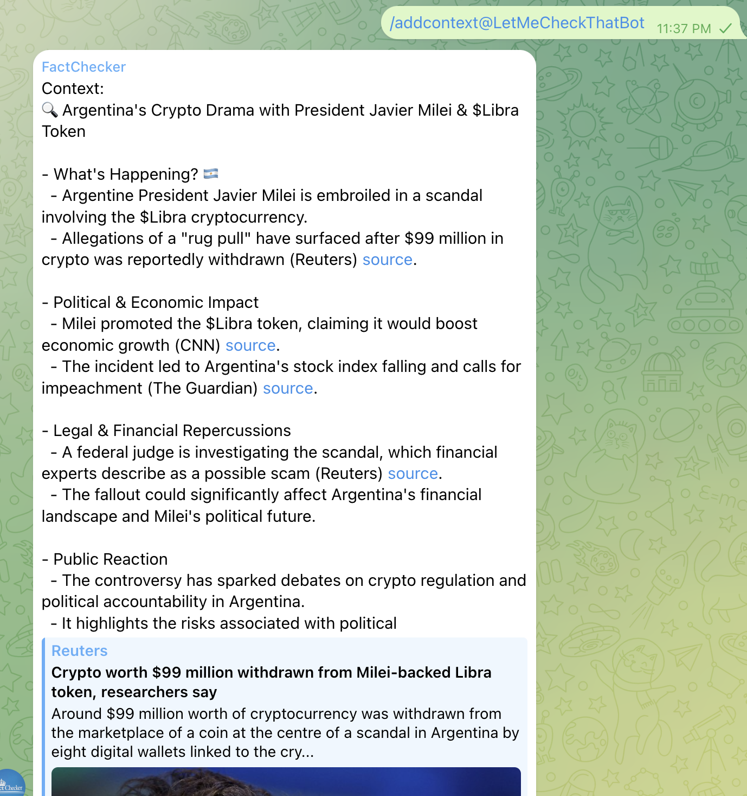

# Telegram Fact-Checker Bot

A Telegram bot that helps group chats stay factual by providing real-time fact-checking, context analysis, and debate moderation using OpenAI's GPT model and reliable web sources. Deployed as an AWS Lambda function for serverless operation.

🤖 **Try it now!** The bot is live and ready to use:
- Visit [@LetMeCheckThatBot](https://t.me/LetMeCheckThatBot) on Telegram
- Add it to your group chats for real-time fact-checking
- Start a direct conversation to test its capabilities


## Features

- 🔍 **Real-time Fact Checking**: Analyzes conversations and provides context from reliable sources
- 🤖 **AI-Powered Responses**: Direct Q&A capabilities using GPT model
- ⚖️ **Debate Analysis**: Evaluates discussions and provides objective analysis
- 📊 **Message History**: Stores chat history in AWS S3 for context awareness
- 🧹 **Chat Management**: Commands to clear history and manage bot messages
- ☁️ **Serverless Architecture**: Deployed as AWS Lambda function for scalability and cost-effectiveness

## Prerequisites

- AWS Account with Lambda and S3 access
- A Telegram Bot Token
- OpenAI API Key
- AWS CLI installed and configured
- Node.js >= 16.0.0 (for local development)

## Deployment

1. Clone the repository
2. Install dependencies:
   ```bash
   npm install
   ```
3. Create a Lambda function in AWS Console:
   - Runtime: Node.js 16.x or later
   - Handler: index.handler
   - Memory: 256MB (recommended)
   - Timeout: 30 seconds

4. Configure environment variables in Lambda:
   - Using npm script:
     ```bash
     npm run set-env -- --function-name YOUR_FUNCTION_NAME --region your-region
     ```
   - Or manually in AWS Console:
     ```env
     TELEGRAM_BOT_TOKEN=your_telegram_bot_token_here
     OPENAI_API_KEY=your_openai_api_key_here
     AWS_REGION=your_aws_region_here
     S3_BUCKET_NAME=your_s3_bucket_name_here
     SERPER_API_KEY=your_serper_api_key_here
     BRAVE_API_KEY=your_brave_api_key_here
     ```

5. Deploy the code:
   - Using npm script:
     ```bash
     npm run deploy -- --function-name YOUR_FUNCTION_NAME --region your-region
     ```
   - Or manually:
     ```bash
     bash deploy.sh --deploy --function-name YOUR_FUNCTION_NAME --region your-region
     ```

6. Set up Telegram Webhook:
   - Create an API Gateway trigger for your Lambda
   - Configure your Telegram bot webhook to point to the API Gateway URL

Note: You can also use the existing deployed bot by adding @LetMeCheckThatBot to your Telegram groups or starting a direct conversation with it.

## Local Development

1. Copy the environment example file:
   ```bash
   cp .env.example .env
   ```

2. Configure your .env file with the same variables as Lambda

3. Start the local development server:
   ```bash
   npm start
   ```

## npm Scripts

- `npm start` - Start the local development server
- `npm run deploy` - Package and deploy to AWS Lambda
- `npm run set-env` - Set environment variables on AWS Lambda
- `npm run logs` - Tail logs of the Lambda function
- `npm test` - Run Jest tests
- `npm run test:watch` - Run tests in watch mode
- `npm run test:coverage` - Run tests with coverage
- `npm run lint` - Run ESLint
- `npm run test:syntax` - Check JavaScript syntax

## Available Commands

- `/context` - Analyze recent messages and provide factual context
- `/settle` - Analyze a debate and provide an objective assessment
- `/clear` - Clear bot message history
- `robot, [question]` - Ask the bot a direct question

## Features in Detail



### Context Analysis
The bot uses OpenAI's GPT model to analyze conversations and provides context from reliable sources like:
- Reuters and Associated Press
- BBC News and Wall Street Journal
- Academic journals and research papers
- Government databases and statistics

### Debate Analysis
When analyzing debates, the bot considers:
- Quality of arguments (logic, reasoning)
- Use of evidence and facts
- Effectiveness of rebuttals
- Clarity and persuasiveness

### Message Storage
Messages are stored in AWS S3 for:
- Maintaining conversation context
- Analyzing discussion patterns
- Providing relevant historical context

## Contributing

Contributions are welcome! Please feel free to submit a Pull Request.

## License

This project is licensed under the MIT License. See package.json for details.