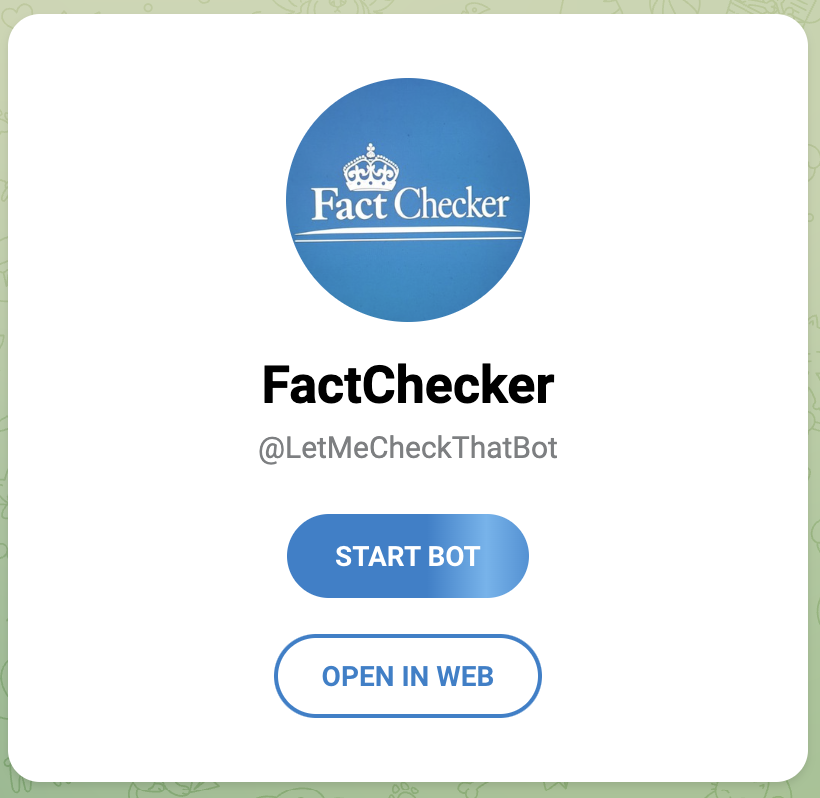
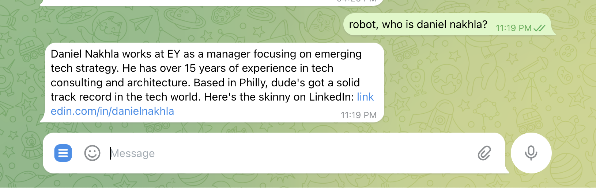

# 🤖 Telegram Fact-Checker Bot

**Empowering your group chats with real-time, AI-powered fact-checking and intelligent analysis.**

This Telegram bot transforms group discussions by providing instant, accurate information and diverse perspectives. Built as an advanced, multi-tool AI agent, it leverages cutting-edge models and a suite of specialized tools to ensure your conversations are grounded in facts.

--- 

### ✨ **Experience the Bot Live!**

- **🚀 Add to Telegram:** [@LetMeCheckThatBot](https://t.me/LetMeCheckThatBot)
- **🌐 Project Website:** [https://dnakhla.github.io/TelegramFactChecker/](https://dnakhla.github.io/TelegramFactChecker/)



---

## 🧠 How It Works: The Intelligent Agent

More than just a chatbot, this bot operates as a sophisticated AI agent capable of complex reasoning and tool utilization. When you pose a question, it follows a dynamic process:

1.  **Understanding Intent:** The AI analyzes your query to grasp its core meaning and context.
2.  **Strategic Tool Selection:** It intelligently determines the optimal tool or sequence of tools required (e.g., a web search followed by summarization, or a Reddit search for public sentiment).
3.  **Information Gathering:** The bot executes the chosen tools, collecting and accumulating relevant data and context from each operation.
4.  **Synthesized Response:** Finally, it synthesizes all gathered information into a concise, conversational, and easy-to-understand response, delivered naturally as a series of short Telegram messages.

This multi-step, adaptive approach allows for highly accurate and nuanced answers, far surpassing the capabilities of traditional single-prompt AI systems.

## 🌟 Key Features

### 🔍 **Advanced Fact-Checking & Research**

The bot employs a comprehensive suite of tools to ensure information accuracy and provide well-rounded insights:

*   **General Web Search:** For broad factual queries and up-to-date information.
*   **Current News Search:** Access to the latest headlines and breaking news from reputable sources.
*   **Reddit Discussions:** Explore public opinion, community sentiment, and user experiences.
*   **Alternative Sources:** Discover diverse perspectives from independent blogs, Substack, Medium, and more.
*   **URL Content Fetching:** Directly read and analyze content from any specified webpage.

### 📊 **AI-Powered Analysis & Personalization**

Leveraging powerful AI models, the bot can do more than just search:

*   **Content Summarization:** Condense lengthy articles or research findings into key bullet points.
*   **Data Manipulation:** Filter, sort, and analyze structured data to extract specific insights.
*   **Personality Adoption:** Engage with the bot from different viewpoints (e.g., `skeptic-bot, is the earth flat?` or `optimist-bot, what's the future of AI?`).

### 🛠️ **Specialized Utility Tools**

Beyond information retrieval, the bot offers practical utilities:

*   **Math Calculations:** Solve complex mathematical expressions instantly.
*   **Image & Video Search:** Find relevant visual and multimedia content.
*   **Accommodation & Places Search:** Look up locations, businesses, and booking information.

### 💬 **Seamless Telegram Integration**

*   **Intuitive Commands:** Easy-to-use commands for quick interaction.
*   **Contextual Memory:** Stores chat history in AWS S3 to maintain conversation context.
*   **Chat Management:** Commands to clear history and manage bot messages within the chat.
*   **Serverless Architecture:** Deployed as an AWS Lambda function for robust scalability and cost-efficiency.



## 🚀 Available Commands

*   `robot, [your question]` or `robot [your question]`
    *   Ask the bot any direct question. The bot will use its tools to find the best answer.
*   `[personality]-bot, [your question]`
    *   Engage the bot with a specific persona. Examples: `optimist-bot, what's the future of AI?`, `skeptic-bot, tell me about climate change.`, `bro-bot, what's up?`
*   `/clearmessages`
    *   Clears all stored message history for the current chat from S3 and attempts to delete recent bot messages from the Telegram interface.
*   `/cancel`
    *   Requests the bot to stop its current operation. Useful if the bot is taking too long or you want to interrupt its process.

## ⚙️ Deployment Guide

This bot is designed for serverless deployment on AWS Lambda.

### Prerequisites

Before you begin, ensure you have:

*   An **AWS Account** with permissions for Lambda, S3, and API Gateway.
*   A **Telegram Bot Token** (obtained from BotFather).
*   An **OpenAI API Key**.
*   A **Serper API Key** (for Google Search, News, Images, Videos, Places).
*   A **Brave API Key** (optional, for Brave Search).
*   **Node.js** (version 16.0.0 or later) installed locally.
*   **AWS CLI** installed and configured with your AWS credentials.

### Steps

1.  **Clone the Repository & Install Dependencies**
    ```bash
    git clone https://github.com/your-username/factcheckerTelegram.git
    cd factcheckerTelegram
    npm install
    ```

2.  **Create AWS Lambda Function**
    *   Navigate to the AWS Lambda console.
    *   Create a new function with the following settings:
        *   **Runtime:** Node.js 16.x or later
        *   **Handler:** `index.handler`
        *   **Memory:** `512MB` (recommended for optimal performance)
        *   **Timeout:** Set to `5 minutes (300 seconds)` to accommodate complex, multi-tool operations.

3.  **Configure Environment Variables**
    *   Create a `.env` file in your project root by copying the example:
        ```bash
        cp .env.example .env
        ```
    *   Fill in your API keys and other configurations in the `.env` file.
    *   Use the provided `set-env` script to upload these variables to your Lambda function:
        ```bash
        npm run set-env -- --function-name YOUR_FUNCTION_NAME --region your-region
        ```
    *   **Required Environment Variables:**
        *   `TELEGRAM_BOT_TOKEN`
        *   `OPENAI_API_KEY`
        *   `S3_BUCKET_NAME`
        *   `SERPER_API_KEY`
        *   `AWS_REGION` (e.g., `us-east-1`)
        *   `GPT_MODEL` (Optional, defaults to `gpt-4.1`. You can specify other models like `gpt-4-turbo`)
        *   `BRAVE_API_KEY` (Optional, if you want to use Brave Search)

4.  **Deploy the Code**
    *   Package and deploy your bot to AWS Lambda using the npm script:
        ```bash
        npm run deploy -- --function-name YOUR_FUNCTION_NAME --region your-region
        ```

5.  **Set up Telegram Webhook**
    *   Create an **API Gateway HTTP API trigger** for your Lambda function.
    *   Copy the generated API Gateway URL.
    *   Configure your Telegram bot's webhook to point to this API Gateway URL. You can do this by visiting:
        `https://api.telegram.org/bot<YOUR_BOT_TOKEN>/setWebhook?url=<YOUR_API_GATEWAY_URL>`

## 💻 Development & Scripts

*   `npm start`: Start the local development server.
*   `npm run deploy`: Package and deploy to AWS Lambda.
*   `npm run set-env`: Set environment variables on AWS Lambda.
*   `npm run logs`: Tail logs of the Lambda function.
*   `npm test`: Run Jest tests.
*   `npm run list-conversations`: List conversation content stored in S3.
*   `npm run delete-conversations`: Delete all conversation history from S3.

## 🤝 Contributing

Contributions are highly welcome! If you have ideas for new features, improvements, or bug fixes, please feel free to submit a Pull Request. For major changes, please open an issue first to discuss what you would like to change.

## 📄 License

This project is licensed under the MIT License - see the `LICENSE` file for details.