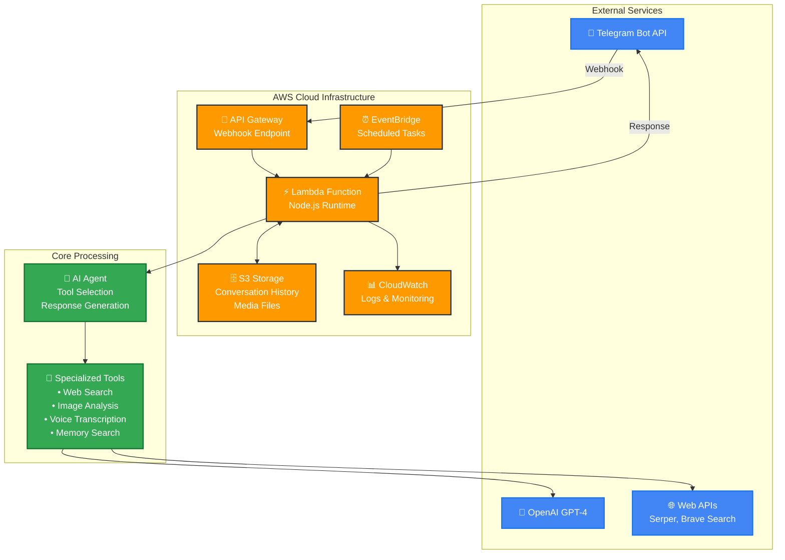
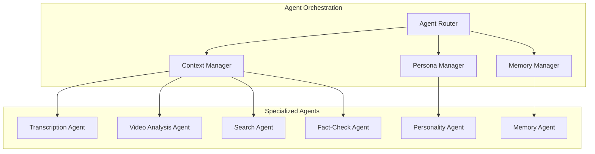

# 🤖 Everything Bot

**The ONLY Telegram Bot That Actually Transcribes Audio, Analyzes Media, Searches the Web & Remembers Everything!**

Everything Bot is an advanced Telegram AI assistant that transforms group discussions by providing instant transcription, media analysis, web research, and persistent memory. Built as a sophisticated AI agent, it leverages cutting-edge models and specialized tools to enhance your conversations with intelligent insights.

--- 

### ✨ **Experience the Bot Live!**

- **🚀 Add to Telegram:** [@LetMeCheckThatBot](https://t.me/LetMeCheckThatBot)
- **🌐 Project Website:** [https://dnakhla.github.io/Everything-Bot/](https://dnakhla.github.io/Everything-Bot/)


---

## 🧠 How It Works: The Intelligent Agent

More than just a chatbot, this bot operates as a sophisticated AI agent capable of complex reasoning and tool utilization. When you pose a question, it follows a dynamic process:

1.  **Understanding Intent:** The AI analyzes your query to grasp its core meaning and context.
2.  **Strategic Tool Selection:** It intelligently determines the optimal tool or sequence of tools required (e.g., a web search followed by summarization, or a Reddit search for public sentiment).
3.  **Information Gathering:** The bot executes the chosen tools, collecting and accumulating relevant data and context from each operation.
4.  **Synthesized Response:** Finally, it synthesizes all gathered information into a concise, conversational, and easy-to-understand response, delivered naturally as a series of short Telegram messages.

This multi-step, adaptive approach allows for highly accurate and nuanced answers, far surpassing the capabilities of traditional single-prompt AI systems.

## 🏗️ System Architecture



## 🌟 Core Capabilities

### 🎤 **Audio Transcription**
*   **Perfect Voice Transcription:** Converts any voice message to accurate text
*   **Multi-language Support:** Handles various languages and accents
*   **Instant Processing:** Fast, reliable transcription in group chats

### 📸 **Media Analysis**
*   **Image Recognition:** Analyzes photos and describes what it sees
*   **Video Frame Extraction:** Processes GIFs and videos frame-by-frame
*   **Visual Understanding:** Reads text in images, identifies objects and scenes

### 🔍 **Web Research & Fact-Checking**
*   **Real-time Web Search:** Access to current information and breaking news
*   **Reddit Discussions:** Explore public opinion and community sentiment
*   **URL Content Analysis:** Directly read and analyze any webpage
*   **Multi-source Verification:** Cross-reference information from multiple sources

### 💾 **Persistent Memory**
*   **Conversation History:** Stores and recalls chat context across days and weeks
*   **Smart Summarization:** "robot summarize our chat" provides intelligent conversation summaries
*   **Context Awareness:** Remembers previous discussions and maintains continuity

### 🎭 **Personality Modes**
*   **Dynamic Personas:** Switch between different response styles (skeptic-bot, optimist-bot, etc.)
*   **Adaptive Responses:** Tailors communication style to match the requested persona
*   **Context-Aware Personalities:** Maintains personality traits throughout conversations

### 💬 **Seamless Telegram Integration**

*   **Intuitive Commands:** Easy-to-use commands for quick interaction.
*   **Contextual Memory:** Stores chat history in AWS S3 to maintain conversation context.
*   **Chat Management:** Commands to clear history and manage bot messages within the chat.
*   **Serverless Architecture:** Deployed as an AWS Lambda function for robust scalability and cost-efficiency.


## 🚀 How to Use

### Basic Commands
*   `robot transcribe this audio` - Add with any voice message for instant transcription
*   `robot what do you see?` - Add with any image for detailed analysis
*   `robot summarize our chat` - Get an intelligent summary of recent conversations
*   `robot search [topic]` - Research any topic with web search and fact-checking
*   `memory-bot remember this` - Store important information for future reference

### Personality Modes
*   `fact-bot search climate data` - Research mode for detailed information gathering
*   `skeptic-bot analyze this claim` - Critical analysis perspective
*   `optimist-bot what's the future of AI?` - Positive, forward-looking responses
*   `conspiracy-bot [question]` - Alternative perspective analysis

### Management Commands
*   `/clearmessages [number]` - Delete bot's last messages (default: 1, max: 20)
*   `/cancel` - Stop current bot operation if taking too long

### Media Support
- **Voice Messages:** Automatically transcribed when you mention "robot"
- **Images & Photos:** Analyzed and described in detail
- **GIFs & Videos:** Frame-by-frame analysis available
- **Documents & Links:** Content extracted and summarized

## 🏗 Architecture & Technical Documentation

### System Architecture Diagrams
For detailed technical documentation and architecture diagrams, see the [`docs/`](docs/) directory:

- **[Complete Architecture Overview](docs/architecture.md)** - Mermaid diagrams showing system overview, agent interactions, and data flow
- **[System Architecture](docs/system-architecture.puml)** - PlantUML diagram with AWS infrastructure components  
- **[Agent Interaction Sequence](docs/agent-sequence.puml)** - Detailed multi-agent coordination flow
- **[Agent Decision Tree](docs/agent-decision-tree.puml)** - Agent selection and routing logic

### Agent-Based Architecture Overview
Everything Bot uses a sophisticated agent-based architecture where specialized AI tools collaborate to handle different types of input:



## ⚙️ Deployment Guide

This bot is designed for serverless deployment on AWS Lambda.

### Prerequisites

Before you begin, ensure you have:

*   An **AWS Account** with permissions for Lambda, S3, and API Gateway.
*   A **Telegram Bot Token** (obtained from BotFather).
*   An **OpenAI API Key**.
*   A **Serper API Key** (for Google Search, News, Images, Videos, Places).
*   A **Brave API Key** (optional, for Brave Search).
*   **Node.js** (version 16.0.0 or later) installed locally.
*   **AWS CLI** installed and configured with your AWS credentials.

### Steps

1.  **Clone the Repository & Install Dependencies**
    ```bash
    git clone https://github.com/your-username/factcheckerTelegram.git
    cd factcheckerTelegram
    npm install
    ```

2.  **Create AWS Lambda Function**
    *   Navigate to the AWS Lambda console.
    *   Create a new function with the following settings:
        *   **Runtime:** Node.js 16.x or later
        *   **Handler:** `index.handler`
        *   **Memory:** `512MB` (recommended for optimal performance)
        *   **Timeout:** Set to `5 minutes (300 seconds)` to accommodate complex, multi-tool operations.

3.  **Configure Environment Variables**
    *   Create a `.env` file in your project root by copying the example:
        ```bash
        cp .env.example .env
        ```
    *   Fill in your API keys and other configurations in the `.env` file.
    *   Use the provided `set-env` script to upload these variables to your Lambda function:
        ```bash
        npm run set-env -- --function-name YOUR_FUNCTION_NAME --region your-region
        ```
    *   **Required Environment Variables:**
        *   `TELEGRAM_BOT_TOKEN`
        *   `OPENAI_API_KEY`
        *   `S3_BUCKET_NAME`
        *   `SERPER_API_KEY`
        *   `AWS_REGION` (e.g., `us-east-1`)
        *   `GPT_MODEL` (Optional, defaults to `gpt-4.1`. You can specify other models like `gpt-4-turbo`)
        *   `BRAVE_API_KEY` (Optional, if you want to use Brave Search)

4.  **Deploy the Code**
    *   Package and deploy your bot to AWS Lambda using the npm script:
        ```bash
        npm run deploy -- --function-name YOUR_FUNCTION_NAME --region your-region
        ```

5.  **Set up Telegram Webhook**
    *   Create an **API Gateway HTTP API trigger** for your Lambda function.
    *   Copy the generated API Gateway URL.
    *   Configure your Telegram bot's webhook to point to this API Gateway URL. You can do this by visiting:
        `https://api.telegram.org/bot<YOUR_BOT_TOKEN>/setWebhook?url=<YOUR_API_GATEWAY_URL>`

## 💻 Development & Scripts

*   `npm start`: Start the local development server.
*   `npm run deploy`: Package and deploy to AWS Lambda.
*   `npm run set-env`: Set environment variables on AWS Lambda.
*   `npm run logs`: Tail logs of the Lambda function.
*   `npm test`: Run Jest tests.
*   `npm run list-conversations`: List conversation content stored in S3.
*   `npm run delete-conversations`: Delete all conversation history from S3.

## 🤝 Contributing

Contributions are highly welcome! If you have ideas for new features, improvements, or bug fixes, please feel free to submit a Pull Request. For major changes, please open an issue first to discuss what you would like to change.

## 📄 License

This project is licensed under the MIT License - see the `LICENSE` file for details.