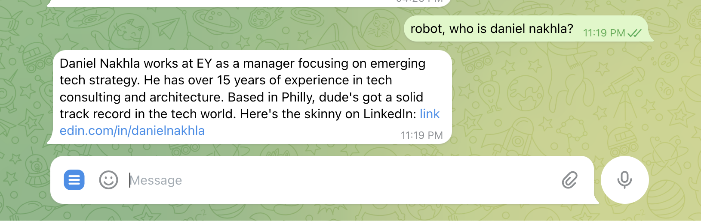

# Telegram Fact-Checker Bot

A Telegram bot that helps group chats stay factual by providing real-time fact-checking, context analysis, and debate moderation using OpenAI's GPT model and reliable web sources.



## Features

- 🔍 **Real-time Fact Checking**: Analyzes conversations and provides context from reliable sources
- 🤖 **AI-Powered Responses**: Direct Q&A capabilities using GPT model
- ⚖️ **Debate Analysis**: Evaluates discussions and provides objective analysis
- 📊 **Message History**: Stores chat history in AWS S3 for context awareness
- 🧹 **Chat Management**: Commands to clear history and manage bot messages

## Prerequisites

- Node.js >= 16.0.0
- A Telegram Bot Token
- OpenAI API Key
- AWS S3 Bucket

## Installation

1. Clone the repository
2. Install dependencies:
   ```bash
   npm install
   ```
3. Copy the environment example file and configure your variables:
   ```bash
   cp .env.example .env
   ```

## Configuration

Set up the following environment variables in your `.env` file:

```env
# Telegram Bot Configuration
TELEGRAM_BOT_TOKEN=your_telegram_bot_token_here

# OpenAI Configuration
OPENAI_API_KEY=your_openai_api_key_here

# AWS Configuration
AWS_REGION=your_aws_region_here
S3_BUCKET_NAME=your_s3_bucket_name_here
```

## Usage

Start the bot:
```bash
npm start
```

### Available Commands

- `/context` - Analyze recent messages and provide factual context
- `/settle` - Analyze a debate and provide an objective assessment
- `/clear` - Clear bot message history
- `robot, [question]` - Ask the bot a direct question

## Features in Detail


### Context Analysis
The bot uses OpenAI's GPT model to analyze conversations and provides context from reliable sources like:
- Reuters and Associated Press
- BBC News and Wall Street Journal
- Academic journals and research papers
- Government databases and statistics

### Debate Analysis
When analyzing debates, the bot considers:
- Quality of arguments (logic, reasoning)
- Use of evidence and facts
- Effectiveness of rebuttals
- Clarity and persuasiveness

### Message Storage
Messages are stored in AWS S3 for:
- Maintaining conversation context
- Analyzing discussion patterns
- Providing relevant historical context

## Contributing

Contributions are welcome! Please feel free to submit a Pull Request.

## License

This project is licensed under the MIT License - see the LICENSE file for details.