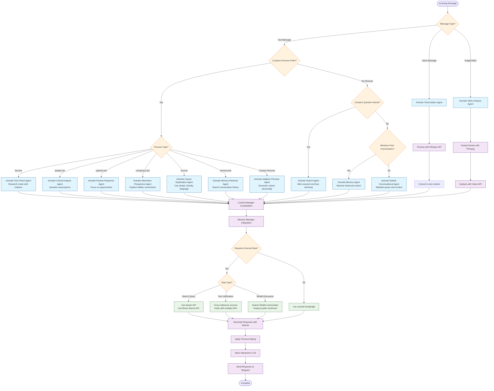

# Everything Bot - Agent Selection Decision Tree

## Decision Tree Description

### Message Processing Flow

The Everything Bot uses a hierarchical decision tree for agent selection:

#### 1. **Message Type Detection**
- **Voice Messages** → Transcription Agent (Whisper API)
- **Images/Videos** → Video Analysis Agent (FFmpeg + Vision API)  
- **Text Messages** → Persona/Content Analysis

#### 2. **Persona Prefix Recognition**
When users include persona prefixes, specific agents activate:
- **fact-bot** → Fact-Check Agent (research mode with citations)
- **skeptic-bot** → Critical Analysis Agent (question assumptions)
- **optimist-bot** → Positive Response Agent (focus on opportunities)
- **conspiracy-bot** → Alternative Perspective Agent (explore hidden connections)
- **bro-bot** → Casual Explanation Agent (simple, friendly language)
- **memory-bot** → Memory Retrieval Agent (search conversation history)
- **Custom personas** → Adaptive Persona Agent (generate custom personality)

#### 3. **Content-Based Agent Selection**
For messages without persona prefixes:
- **Questions** → Search Agent (web research and fact-checking)
- **Past conversation references** → Memory Agent (retrieve historical context)
- **General chat** → Default Conversational Agent (maintain group context)

#### 4. **External Data Integration**
Based on agent needs:
- **Search queries** → Serper API, Brave Search API
- **Fact verification** → Cross-reference multiple sources
- **Reddit discussions** → Community search and sentiment analysis

#### 5. **Coordination & Memory**
- **Context Manager** coordinates between all agents
- **Memory Manager** stores every interaction in S3
- **Response Generation** applies persona styling before delivery

### Key Features

- **Hierarchical Decision Making**: Message type → Persona → Content analysis
- **Agent Coordination**: All agents work through Context Manager
- **Persistent Memory**: Every interaction stored for future context
- **External API Integration**: Multiple data sources for comprehensive responses
- **Adaptive Personalities**: Dynamic persona generation for custom requests