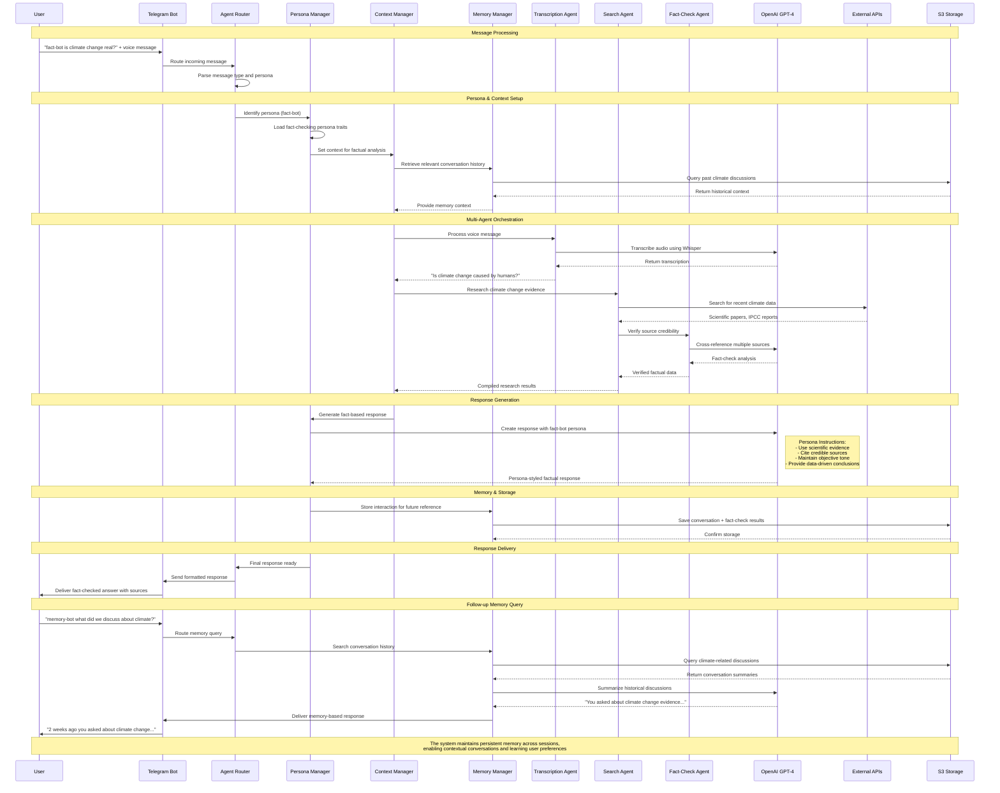

# Everything Bot - Multi-Agent Interaction Flow

## Interaction Flow Description

### 1. Message Processing
The user sends a message with a persona prefix ("fact-bot") and voice content. The Telegram Bot receives this and routes it to the Agent Router for processing.

### 2. Persona & Context Setup
- **Agent Router** parses the message to identify the requested persona
- **Persona Manager** loads the specific traits for "fact-bot" persona
- **Context Manager** receives the context and requests relevant history
- **Memory Manager** queries S3 for past climate-related discussions

### 3. Multi-Agent Orchestration
- **Transcription Agent** processes the voice message using OpenAI Whisper
- **Search Agent** researches climate change evidence from external APIs
- **Fact-Check Agent** verifies source credibility and cross-references information
- All agents coordinate through the Context Manager

### 4. Response Generation
The Persona Manager generates a response using the fact-bot persona with:
- Scientific evidence emphasis
- Credible source citations
- Objective tone
- Data-driven conclusions

### 5. Memory & Storage
The interaction is stored in S3 for future reference, enabling the bot to remember and reference past conversations.

### 6. Follow-up Capabilities
Users can query past conversations using "memory-bot", demonstrating the system's persistent memory and contextual awareness across sessions.