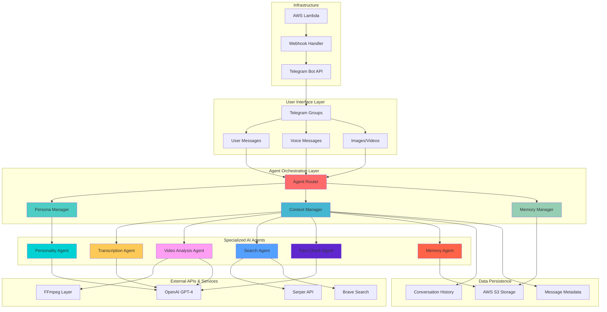
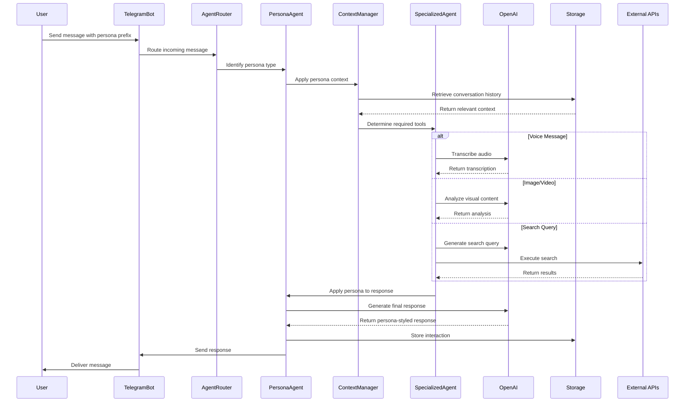
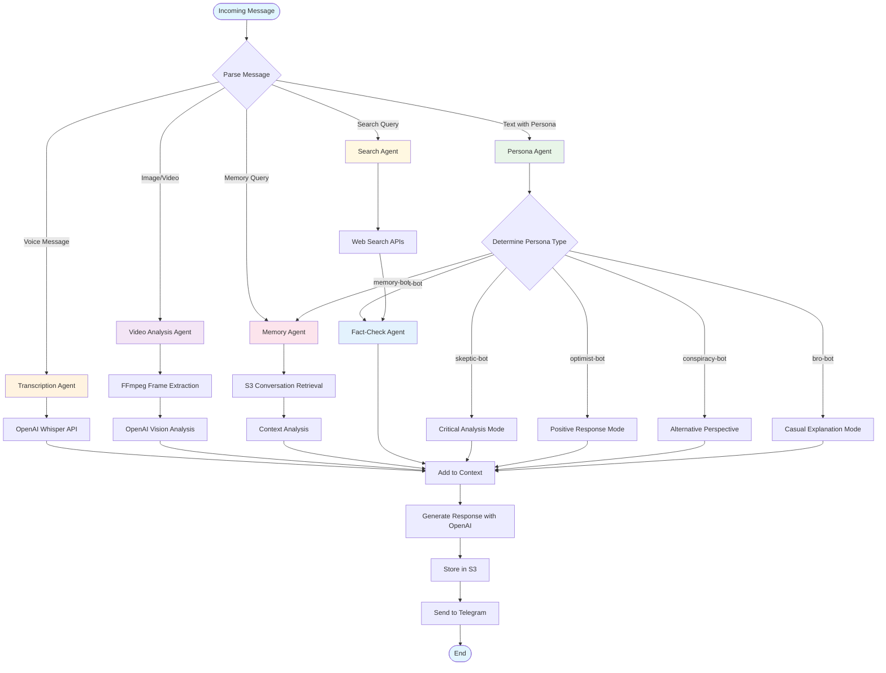
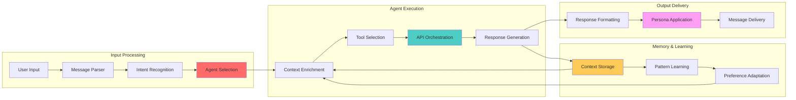
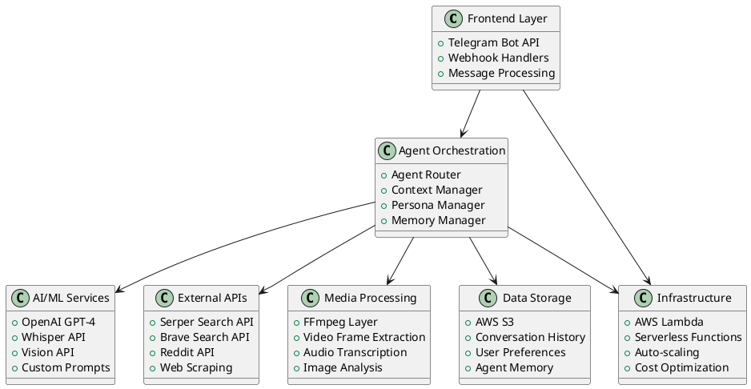

# Everything Bot - Agentic AI Architecture

## System Architecture Overview

## Agent Interaction Flow

## Multi-Agent Decision Tree

## Data Flow Architecture

## Technology Stack

## Agent Capabilities Matrix

| Agent Type | Input Types | Processing | Output | Memory |
|------------|-------------|------------|---------|---------|
| **Transcription Agent** | Voice Messages | Whisper API | Text Transcription | Context History |
| **Video Analysis Agent** | Videos/GIFs | FFmpeg + Vision | Frame Analysis | Visual Memory |
| **Search Agent** | Text Queries | Multi-API Search | Web Results | Search Patterns |
| **Fact-Check Agent** | Claims/Statements | Cross-reference | Verification | Source Database |
| **Persona Agent** | Any Input | Style Adaptation | Persona Response | Personality Traits |
| **Memory Agent** | Context Queries | S3 Retrieval | Historical Data | Long-term Storage |

## Key Agentic AI Features

### 1. **Autonomous Decision Making**
- Agents automatically select appropriate tools based on input type
- Dynamic persona switching without manual configuration
- Self-directed search and fact-checking workflows

### 2. **Multi-Modal Processing**
- Voice → Text transcription with context preservation
- Video → Frame-by-frame analysis with temporal understanding
- Image → Object recognition and text extraction

### 3. **Persistent Memory**
- Conversation continuity across sessions
- User preference learning and adaptation
- Group context awareness and history

### 4. **Collaborative Agent Network**
- Agents share context and coordinate responses
- Hierarchical decision-making with specialized roles
- Dynamic tool selection and API orchestration

### 5. **Real-time Adaptation**
- Persona switching mid-conversation
- Context-aware response generation
- Learning from user feedback and interactions

## Business Impact & Scalability

- **Target Market**: 1B+ Telegram users in group chats
- **Use Cases**: Fantasy sports, gaming communities, work teams, educational groups
- **Monetization**: Freemium model with premium personalities and features
- **Scalability**: Serverless architecture with auto-scaling Lambda functions
- **Cost Efficiency**: Pay-per-use model with intelligent caching and optimization