# Everything Bot - System Architecture

```mermaid
graph TB
    %% User Interface Layer
    subgraph "User Interface Layer"
        TG[Telegram Groups]
        VM[Voice Messages]
        IV[Images/Videos]
        TM[Text Messages]
    end

    %% Agent Orchestration Core
    subgraph "Agent Orchestration Core"
        AR[Agent Router]:::lightblue
        PM[Persona Manager]:::lightgreen
        CM[Context Manager]:::lightyellow
        MM[Memory Manager]:::lightpink
    end

    %% Specialized AI Agents
    subgraph "Specialized AI Agents"
        TA[Transcription Agent]:::orange
        VA[Video Analysis Agent]:::purple
        SA[Search Agent]:::blue
        FA[Fact-Check Agent]:::red
        PA[Personality Agent]:::green
        MRA[Memory Retrieval Agent]:::pink
    end

    %% External AI Services
    subgraph "External AI Services"
        GPT4[OpenAI GPT-4]
        WHISPER[Whisper API]
        VISION[Vision API]
    end

    %% Search & Data APIs
    subgraph "Search & Data APIs"
        SERPER[Serper API]
        BRAVE[Brave Search]
        REDDIT[Reddit API]
    end

    %% Media Processing
    subgraph "Media Processing"
        FFMPEG[FFmpeg Layer]
        FE[Frame Extraction]
        AP[Audio Processing]
    end

    %% AWS Infrastructure
    subgraph "AWS Infrastructure"
        LAMBDA[Lambda Functions<br/>Serverless Compute]
        S3BUCKET[S3 Storage<br/>Conversation Data]
        APIGW[API Gateway<br/>Webhook Handler]
    end

    %% Data Storage
    subgraph "Data Storage"
        CH[Conversation History]
        UP[User Preferences]
        AM[Agent Memory]
        MD[Message Metadata]
    end

    %% User interactions
    TG --> TM
    TG --> VM
    TG --> IV

    %% Core routing
    TM --> AR
    VM --> AR
    IV --> AR

    %% Agent orchestration
    AR --> PM
    AR --> CM
    AR --> MM

    %% Specialized agent activation
    PM --> PA
    CM --> TA
    CM --> VA
    CM --> SA
    CM --> FA
    MM --> MRA

    %% External service connections
    TA --> WHISPER
    TA --> GPT4
    VA --> FFMPEG
    VA --> VISION
    SA --> SERPER
    SA --> BRAVE
    SA --> REDDIT
    FA --> GPT4
    PA --> GPT4
    MRA --> S3BUCKET

    %% Media processing flow
    VM --> AP
    IV --> FE
    AP --> TA
    FE --> VA

    %% Data persistence
    CM --> CH
    PM --> UP
    MM --> AM
    AR --> MD

    %% Infrastructure connections
    AR --> LAMBDA
    LAMBDA --> S3BUCKET
    APIGW --> LAMBDA
    TG --> APIGW

    %% Memory feedback loops
    CH --> CM
    UP --> PM
    AM --> MM
    MD --> AR

    %% Styling
    classDef lightblue fill:#ADD8E6
    classDef lightgreen fill:#90EE90
    classDef lightyellow fill:#FFFFE0
    classDef lightpink fill:#FFB6C1
    classDef orange fill:#FFA500
    classDef purple fill:#800080
    classDef blue fill:#0000FF
    classDef red fill:#FF0000
    classDef green fill:#008000
    classDef pink fill:#FFC0CB
```

## Architecture Notes

### Agent Router
Routes messages to appropriate agents based on content type, persona prefix, and context

### Persona Manager
Manages personality switching:
- fact-bot, skeptic-bot
- optimist-bot, conspiracy-bot
- bro-bot, memory-bot

### Context Manager
Maintains conversation context:
- Multi-turn dialogues
- Group chat awareness
- Cross-session memory

### Memory Manager
Long-term memory management:
- Stores conversation history
- Learns user preferences
- Maintains group dynamics